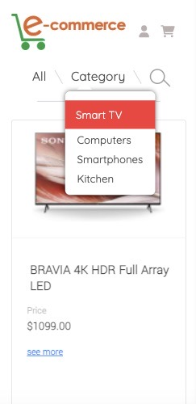
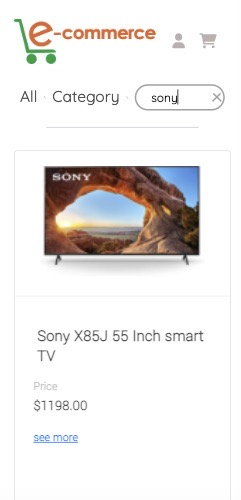
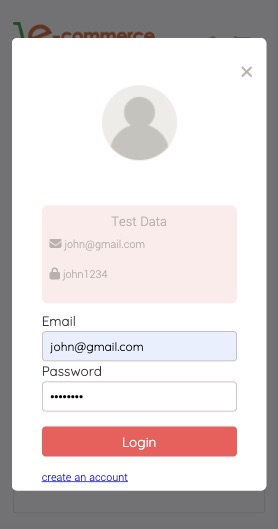
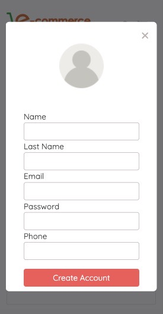
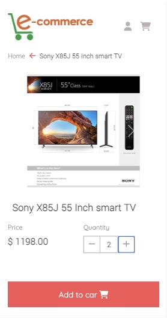
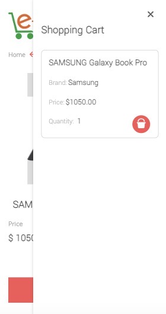

# E-commerce

    Online store of technological products, you can filter products by category or by name and add them to the shopping cart.

---

## Description

Filtering of 4 categories and by product name

To add products to the shopping cart you need to login, if you don't have an account you can create one.

Each product has a detail page, showing carousel images, product description, a counter and add to cart button.

You can view the list of products added to the cart and delete them from there.

---

### Technologies

- Create React App
- React Router
- Redux
- redux-thunk
- React Hooks
- Responsive Web Design
- css
- [API](https://documenter.getpostman.com/view/5028918/UVypxw3W#8d80d26a-7c0a-4283-a272-253ae4144624)

---

#### Installation

To run on your local computer

- git fork
- git clone
- npm install
- npm start

you can also see a demo [here]()
